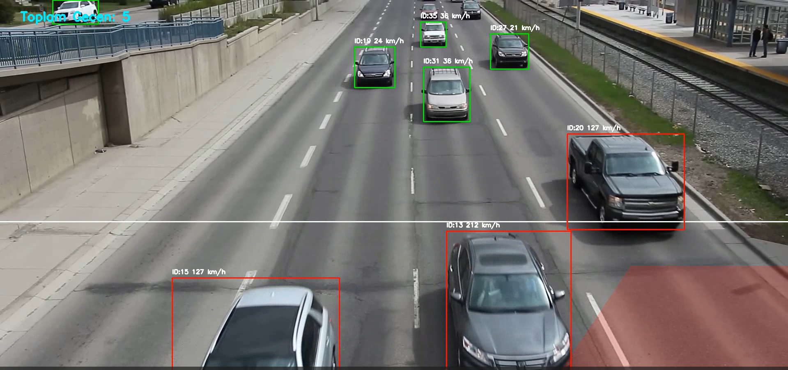

# 🚗 AI-Based Traffic Analysis
Bu proje; otoyol ve şehir içi trafik akışını modernize etmek amacıyla geliştirilmiş, YOLOv8 tabanlı bir bilgisayarlı görü (Computer Vision) sistemidir. Görüntü işleme tekniklerini kullanarak araç tespiti, takibi ve hız analizi yapar.

## 🚀 Temel Yetenekler
Multimodal Object Tracking: ByteTrack algoritması entegrasyonu ile araçlara benzersiz ID'ler atanır.

Dinamik Hız Analizi: Araçların pikseller üzerindeki yer değiştirmesi, zamana oranlanarak gerçek dünya hız verilerine (km/h) dönüştürülür.

İhlal Algılama Sistemi: * Hız İhlali: Belirlenen eşik değerlerin (SpeedLimit>80) üzerindeki araçlar işaretlenir.

Bölge İhlali (ROI): Tanımlanan yasaklı alanlara giren araçlar anlık olarak tespit edilir.

Gelişmiş Araç Sayımı: Çizgi geçiş algoritması ile trafik yoğunluğu takip edilir.

## 🧬 Matematiksel Model ve Mantık
Sistem, hız tahminini yapmak için Öklid Mesafesi ve Zaman Oranlaması prensiplerini kullanır.
### Hız Hesaplama Formülü:
$$
V_{km/h} = \frac{\sqrt{(x_2 - x_1)^2 + (y_2 - y_1)^2} \cdot FPS \cdot 3.6}{PPM}
$$

**Değişken Açıklamaları:**
* $(x, y)$: Aracın $t$ anındaki merkez koordinatları.
* **FPS**: Videonun saniye başına kare hızı.
* **PPM (Pixels Per Meter)**: Görüntüdeki perspektife göre kalibre edilmiş piksel/metre oranı.

## 📸 Proje Önizlemesi

---